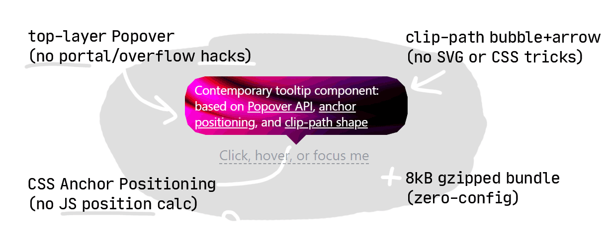
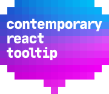

# Contemporary React Tooltip

[](https://www.npmjs.com/package/react-tooltip-contemporary)
[](https://www.npmjs.com/package/react-tooltip-contemporary)

A small [8kB gzipped](https://bundlephobia.com/package/react-tooltip-contemporary@0.0.8), [no dependency](https://www.npmjs.com/package/react-tooltip-contemporary?activeTab=dependencies), React tooltip built on modern web-platform features:

- **Native Popover API** — the bubble lives in the browser **top layer**, so
  it escapes `overflow: hidden` and `z-index` stacking with no portal.
- **CSS anchor positioning** — the bubble pins itself to its trigger with
  `anchor-name` / `position-anchor` / `anchor()`; no JS measuring on scroll.
  Browsers without native support (currently Firefox) degrade gracefully to
  the element's native `title` tooltip — no polyfill, no extra dependency.
- **Pure-CSS shape** — the rounded bubble _and_ its arrow are one
  `clip-path: polygon(...)` — no borders, pseudo-elements or SVG.
- **Zero-config styling** — each component injects its own stylesheet slice
  at runtime; no CSS import and no bundler CSS loader required.

```tsx
import { Tooltip } from 'react-tooltip-contemporary';
```

| Mode                   | Markup                                                                                                                                            |
| ---------------------- | ------------------------------------------------------------------------------------------------------------------------------------------------- |
| **Wrapping** (default) | `<Tooltip content="Saved">`<br>`  <button>Save</button>`<br>`</Tooltip>`                                                                          |
| **External by ref**    | `<button ref={ref}>Save</button>`<br>`<Tooltip anchorRef={ref} content="Saved" />`                                                                |
| **External by name**   | `<button style={{ anchorName: '--s' }}>Save</button>`<br>`<Tooltip anchorName="--s" content="Saved"`<br>`  open={open} onOpenChange={setOpen} />` |

## Components

Each component injects its own stylesheet slice at runtime, so all three
work standalone with no CSS import.

| Export          | Role                                            |
| --------------- | ----------------------------------------------- |
| `Tooltip`       | The tooltip — behaviour, triggers, positioning. |
| `TooltipShape`  | The bubble: the clip-path shape + arrow.        |
| `TooltipAnchor` | The "anchor" half of CSS anchor positioning.    |

## `Tooltip` props

| Prop             | Type                                     | Default              | Notes                                                                                      |
| ---------------- | ---------------------------------------- | -------------------- | ------------------------------------------------------------------------------------------ |
| `children`       | `ReactNode`                              | —                    | The trigger element (wrapping mode).                                                       |
| `content`        | `ReactNode`                              | —                    | The bubble content.                                                                        |
| `placement`      | `'top' \| 'bottom' \| 'left' \| 'right'` | `'top'`              | Preferred side of the anchor.                                                              |
| `arrowPlacement` | `'start' \| 'center' \| 'end'`           | `'center'`           | Which way the bubble extends; arrow stays on the anchor centre (see below).                |
| `trigger`        | `('hover' \| 'focus' \| 'click')[]`      | `['hover', 'focus']` | Interactions that reveal the tooltip.                                                      |
| `delayShow`      | `number`                                 | `200`                | ms before showing (hover/focus only; click is instant).                                    |
| `delayHide`      | `number`                                 | `100`                | ms before hiding (hover/focus only; click is instant).                                     |
| `offset`         | `string`                                 | `'0.25em'`           | Gap between anchor and bubble (any CSS length).                                            |
| `autoFlip`       | `boolean`                                | `true`               | Flip to the opposite side when it would overflow.                                          |
| `defaultOpen`    | `boolean`                                | `false`              | Initial open state (uncontrolled).                                                         |
| `open`           | `boolean`                                | —                    | Controlled open state; pair with `onOpenChange`.                                           |
| `onOpenChange`   | `(open: boolean) => void`                | —                    | Fires when the open state should change.                                                   |
| `bubbleStyle`    | `TooltipBubbleStyle`                     | —                    | Bubble appearance (see below).                                                             |
| `className`      | `string`                                 | —                    | Applied to the popover element.                                                            |
| `style`          | `CSSProperties`                          | —                    | Applied to the popover element.                                                            |
| `anchorRef`      | `RefObject<HTMLElement>`                 | —                    | Attach to an existing element instead of wrapping `children`. See _External anchor_ below. |
| `anchorName`     | `string`                                 | —                    | Use this CSS anchor name verbatim. See _External anchor_ below.                            |

### `arrowPlacement`

The arrow always points at the **anchor's centre** — `arrowPlacement` only
chooses which way the bubble body extends from it. `'center'` (default) centres
the bubble on the anchor; `'start'` keeps the arrow near the bubble's leading
edge so the body grows toward the trailing side; `'end'` mirrors that. Handy
when the anchor sits near a viewport edge and you want the bubble to grow the
other way. The axis follows `placement` — left→right for `top`/`bottom`,
top→bottom for `left`/`right`.

```tsx
<Tooltip content="Aligned to the start" placement="top" arrowPlacement="start">
  <button>Hover me</button>
</Tooltip>
```

### `bubbleStyle`

Per-instance look of the bubble. Pass any subset; omitted fields fall back to
the library defaults. Most fields are applied as CSS custom properties on the
bubble — the one exception is `cornerSegments`, which selects a `.corners-N`
class.

| Field                | Type                    | Default      | Notes                                                                                    |
| -------------------- | ----------------------- | ------------ | ---------------------------------------------------------------------------------------- |
| `background`         | `string`                | `'#000'`     | Bubble background (any CSS `background`).                                                |
| `color`              | `string`                | `'#fff'`     | Text color.                                                                              |
| `fontSize`           | `string`                | `'0.875rem'` | Bubble font size.                                                                        |
| `radius`             | `string`                | `'0.5rem'`   | Corner radius (any CSS length).                                                          |
| `arrowSize`          | `string`                | `'0.5rem'`   | Arrow size (half-diagonal).                                                              |
| `paddingX`           | `string`                | `'0.7rem'`   | Horizontal padding.                                                                      |
| `paddingY`           | `string`                | `'0.4rem'`   | Vertical padding.                                                                        |
| `maxWidth`           | `string`                | `'16rem'`    | Maximum bubble width.                                                                    |
| `transitionDuration` | `string`                | `'0.2s'`     | Fade in/out (and flip) duration.                                                         |
| `cornerSegments`     | `3 \| 4 \| 5 \| 6 \| 7` | `5`          | Straight segments per rounded corner — higher is smoother. Selects a `.corners-N` class. |

```tsx
<Tooltip
  content="Custom bubble"
  bubbleStyle={{
    background: '#2563eb',
    color: '#fff',
    radius: '0.8rem',
    arrowSize: '0.6rem',
    paddingX: '1rem',
    paddingY: '0.5rem',
    maxWidth: '20rem',
    transitionDuration: '0.25s',
    cornerSegments: 7,
  }}
>
  <button>Hover me</button>
</Tooltip>
```

## Controlled usage

```tsx
const [open, setOpen] = useState(false);

<Tooltip open={open} onOpenChange={setOpen} content="Controlled">
  <button>Anchor</button>
</Tooltip>;
```

## External anchor (skip the wrapper)

When you'd rather attach the tooltip to an element you already render —
without `Tooltip` wrapping it in an extra `<div>` — pass `anchorRef` and
omit `children`. `Tooltip` writes `anchor-name` onto the referenced
element, wires the configured triggers to it, and mirrors
`aria-describedby` on it for accessibility:

```tsx
const btnRef = useRef<HTMLButtonElement>(null);

<>
  <button ref={btnRef}>Save</button>
  <Tooltip anchorRef={btnRef} content="Saved" />
</>;
```

If you'd rather own the CSS anchor name yourself, use `anchorName`. In
this mode `Tooltip` has no handle to your element, so it cannot wire
triggers — pair with controlled `open` / `onOpenChange`:

```tsx
const [open, setOpen] = useState(false);

<>
  <button
    style={{ anchorName: '--save-btn' } as CSSProperties}
    onMouseEnter={() => setOpen(true)}
    onMouseLeave={() => setOpen(false)}
  >
    Save
  </button>
  <Tooltip
    anchorName="--save-btn"
    open={open}
    onOpenChange={setOpen}
    content="Saved"
  />
</>;
```

## Browser support

Native Popover API, `@starting-style` and CSS anchor positioning are used.
Popover and `@starting-style` are supported across current Chrome, Safari and
Firefox; CSS anchor positioning is native in Chromium and Safari. Where it is
missing (currently Firefox) there is no polyfill and no extra dependency — the
styled bubble is skipped and string `content` is surfaced through the
element's native `title` tooltip instead.

## Development

```bash
npm install
npm run dev        # Storybook + css-to-js watcher
npm run build      # type-check, build to lib/, generate + copy CSS
npm test
```

Each component owns a `*.css` file; `css-to-js` regenerates the matching
`*.css.generated.js`, which the component injects at runtime.

## License

MIT © Sergey Yakunin

<p align="center">
  
</p>
