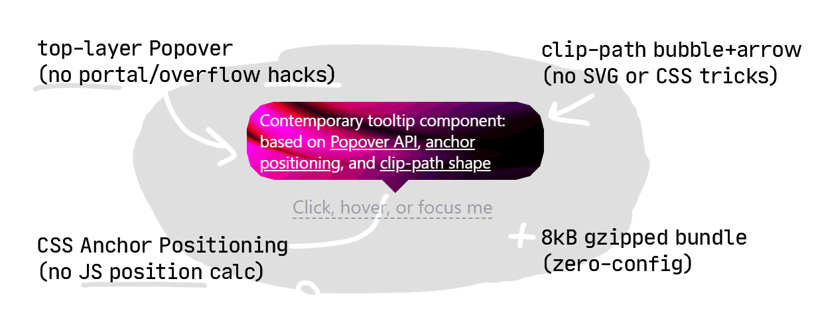
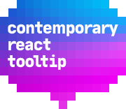

# Contemporary React Tooltip [](https://www.npmjs.com/package/react-tooltip-contemporary) [](https://www.npmjs.com/package/react-tooltip-contemporary)

✨ [Demo](https://yakunins.github.io/react-tooltip/) · 📖 [Storybook](https://react-tooltip-contemporary.vercel.app/)

[8kB gzipped](https://bundlephobia.com/package/react-tooltip-contemporary@0.2.0), [no dependency](https://www.npmjs.com/package/react-tooltip-contemporary?activeTab=dependencies) React tooltip built on modern web features:

- **CSS anchor positioning**: the bubble pins itself to its trigger with
  `anchor-name` / `position-anchor` / `anchor()`; no JS measuring on scroll.
  Old browsers degrade gracefully to a native `title` tooltip, no polyfill, no extra dependency.
- **Popover API**: the bubble lives in the browser's top layer, it escapes `overflow: hidden` and `z-index` stacking with no portal.
- **Pure CSS shape**: the rounded bubble _and_ its arrow are one
  `clip-path: polygon(...)`, no borders, no pseudo-elements or SVG.
- **Zero-config styling**: each component injects its own stylesheet slice
  at runtime; no CSS import and no bundler CSS loader required.

| Mode                   | Markup                                                                                                                                            |
| ---------------------- | ------------------------------------------------------------------------------------------------------------------------------------------------- |
| **Wrapping** (default) | `<Tooltip content="Saved">`<br>`  <button>Save</button>`<br>`</Tooltip>`                                                                          |
| **External by ref**    | `<button ref={ref}>Save</button>`<br>`<Tooltip anchorRef={ref} content="Saved" />`                                                                |
| **External by name**   | `<button style={{ anchorName: '--s' }}>Save</button>`<br>`<Tooltip anchorName="--s" content="Saved"`<br>`  open={open} onOpenChange={setOpen} />` |

## Components

Each component injects its own stylesheet slice at runtime, so each one
works standalone with no CSS import.

| Export           | Role                                          |
| ---------------- | --------------------------------------------- |
| `Tooltip`        | Behavior, triggers, positioning.              |
| `TooltipBubble`  | The bubble, i.e. the clip-path shape + arrow. |
| `TooltipAnchor`  | The anchor part of CSS anchor positioning.    |
| `TooltipPopover` | The top-layer popover that holds the bubble.  |

## `Tooltip` props

| Prop                | Type                                     | Default              | Notes                                                                                      |
| ------------------- | ---------------------------------------- | -------------------- | ------------------------------------------------------------------------------------------ |
| `children`          | `ReactNode`                              | –                    | The trigger element (wrapping mode).                                                       |
| `content`           | `ReactNode`                              | –                    | The bubble content.                                                                        |
| `placement`         | `'top' \| 'bottom' \| 'left' \| 'right'` | `'top'`              | Preferred side of the anchor.                                                              |
| `arrowPlacement`    | `'start' \| 'center' \| 'end'`           | `'center'`           | Which way the bubble extends; arrow stays on the anchor center (see below).                |
| `triggers`          | `('hover' \| 'focus' \| 'click')[]`      | `['hover', 'focus']` | Interactions that reveal the tooltip.                                                      |
| `timings`           | `TooltipTimings`                         | see below            | Show/hide delays, click guard, minimum visible time (ms).                                  |
| `offset`            | `string`                                 | `'0rem'`             | Gap between anchor and bubble (any CSS length).                                            |
| `flip`              | `boolean`                                | `true`               | Flip to the opposite side when it would overflow.                                          |
| `animationDuration` | `string`                                 | `'0.2s'`             | Fade duration (CSS time); the flip slide takes twice as long.                              |
| `defaultOpen`       | `boolean`                                | `false`              | Initial open state (uncontrolled).                                                         |
| `open`              | `boolean`                                | –                    | Controlled open state; pair with `onOpenChange`.                                           |
| `onOpenChange`      | `(open: boolean) => void`                | –                    | Fires when the open state should change.                                                   |
| `bubbleStyle`       | `TooltipBubbleStyle`                     | –                    | Bubble appearance (see below).                                                             |
| `className`         | `string`                                 | –                    | Applied to the popover element.                                                            |
| `style`             | `CSSProperties`                          | –                    | Applied to the popover element.                                                            |
| `anchorRef`         | `RefObject<HTMLElement>`                 | –                    | Attach to an existing element instead of wrapping `children`. See _External anchor_ below. |
| `anchorName`        | `string`                                 | –                    | Use this CSS anchor name verbatim. See _External anchor_ below.                            |

### `timings`

All in ms; pass any subset, the rest keep their defaults.

| Field            | Default | Notes                                                                          |
| ---------------- | ------- | ------------------------------------------------------------------------------ |
| `showDelay`      | `200`   | Before showing on hover/focus; click is instant.                               |
| `hideDelay`      | `100`   | Before hiding on hover-out/blur; click is instant.                             |
| `clickGuard`     | `1000`  | A click this soon after a hover/focus reveal keeps it open instead of closing. |
| `minVisibleTime` | `1000`  | A hover/focus-revealed tooltip stays at least this long.                       |

```tsx
<Tooltip content="Patient" timings={{ showDelay: 500, minVisibleTime: 0 }}>
  <button>Hover me</button>
</Tooltip>
```

### `arrowPlacement`

The arrow always points at the **anchor's center**, `arrowPlacement` only
chooses which way the bubble body extends from it. `'center'` (default) centers
the bubble on the anchor; `'start'` keeps the arrow near the bubble's leading
edge so the body grows toward the trailing side; `'end'` mirrors that. Handy
when the anchor sits near a viewport edge and you want the bubble to grow the
other way. The axis follows `placement`: left→right for `top`/`bottom`,
top→bottom for `left`/`right`.

```tsx
<Tooltip content="Aligned to the start" placement="top" arrowPlacement="start">
  <button>Hover me</button>
</Tooltip>
```

### `bubbleStyle`

Per-instance look of the bubble. Pass any subset; omitted fields fall back to
the library defaults. Most fields are applied as CSS custom properties on the
bubble. The one exception is `cornerSegments`, which sets a `data-corners`
attribute.

| Field            | Type          | Default      | Notes                                                     |
| ---------------- | ------------- | ------------ | --------------------------------------------------------- |
| `background`     | `string`      | `'#000'`     | Bubble background (any CSS `background`).                 |
| `color`          | `string`      | `'#fff'`     | Text color.                                               |
| `fontSize`       | `string`      | `'0.875rem'` | Bubble font size.                                         |
| `radius`         | `string`      | `'0.5rem'`   | Corner radius (any CSS length).                           |
| `arrowSize`      | `string`      | `'0.5rem'`   | Arrow size (half-diagonal).                               |
| `paddingX`       | `string`      | `'0.7rem'`   | Horizontal padding.                                       |
| `paddingY`       | `string`      | `'0.4rem'`   | Vertical padding.                                         |
| `maxWidth`       | `string`      | `'16rem'`    | Maximum bubble width.                                     |
| `cornerSegments` | `3 \| 5 \| 7` | `5`          | Straight segments per rounded corner, higher is smoother. |

```tsx
<Tooltip
  content="Custom bubble"
  animationDuration="0.25s"
  bubbleStyle={{
    background: '#2563eb',
    color: '#fff',
    radius: '0.8rem',
    arrowSize: '0.6rem',
    paddingX: '1rem',
    paddingY: '0.5rem',
    maxWidth: '20rem',
    cornerSegments: 7,
  }}
>
  <button>Hover me</button>
</Tooltip>
```

## Controlled usage

```tsx
const [open, setOpen] = useState(false);

<Tooltip open={open} onOpenChange={setOpen} content="Controlled">
  <button>Anchor</button>
</Tooltip>;
```

## External anchor (skip the wrapper)

When you'd rather attach the tooltip to an element you already render,
without `Tooltip` wrapping it in an extra `<div>`, pass `anchorRef` and
omit `children`. `Tooltip` writes `anchor-name` onto the referenced
element, wires the configured triggers to it, and mirrors
`aria-describedby` on it for accessibility:

```tsx
const btnRef = useRef<HTMLButtonElement>(null);

<>
  <button ref={btnRef}>Save</button>
  <Tooltip anchorRef={btnRef} content="Saved" />
</>;
```

If you'd rather own the CSS anchor name yourself, use `anchorName`. In
this mode `Tooltip` has no handle to your element, so it cannot wire
triggers; pair with controlled `open` / `onOpenChange`:

```tsx
const [open, setOpen] = useState(false);

<>
  <button
    style={{ anchorName: '--save-btn' } as CSSProperties}
    onMouseEnter={() => setOpen(true)}
    onMouseLeave={() => setOpen(false)}
  >
    Save
  </button>
  <Tooltip
    anchorName="--save-btn"
    open={open}
    onOpenChange={setOpen}
    content="Saved"
  />
</>;
```

## Styling hooks

Each part has one class, and its state is in data attributes, so custom CSS
can target them without colliding with other libraries:

| Element        | Class             | Data attributes                                      |
| -------------- | ----------------- | ---------------------------------------------------- |
| Popover        | `tooltip-popover` | `data-placement`, `data-arrow`, `data-anchor-hidden` |
| Bubble         | `tooltip-bubble`  | `data-placement`, `data-arrow`, `data-corners`       |
| Anchor wrapper | `tooltip-anchor`  |                                                      |

```css
.tooltip-popover[data-placement='bottom'] .tooltip-bubble {
  font-weight: 600;
}
```

## Content Security Policy

The components inject their CSS as `<style>` tags. Under a strict `style-src`
policy they pick up the page's nonce automatically, from
`<meta property="csp-nonce" nonce="…">` (what Vite's `html.cspNonce` adds) or
else from any `<script nonce="…">`. Nothing to configure.

## Browser support

Where CSS anchor positioning or the Popover API is missing, there is no polyfill
and no extra dependency. The styled bubble is skipped and string `content` is
surfaced through the element's native `title` tooltip instead. Without the Web
Animations API the bubble shows and hides instantly; without
`IntersectionObserver`, flipping and the hidden-anchor fade are off.

## Development

```bash
npm install
npm run dev        # Storybook + css-to-js watcher
npm run build      # type-check, build to lib/, generate CSS modules
npm test
```

Each component owns a `*.css` file; `css-to-js` regenerates the matching
`*.css.generated.js`, which the component injects at runtime.

## License

MIT © Sergey Yakunin

<p align="center">
  
</p>
